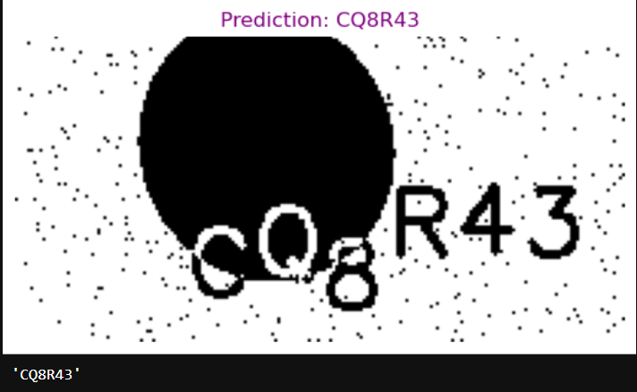
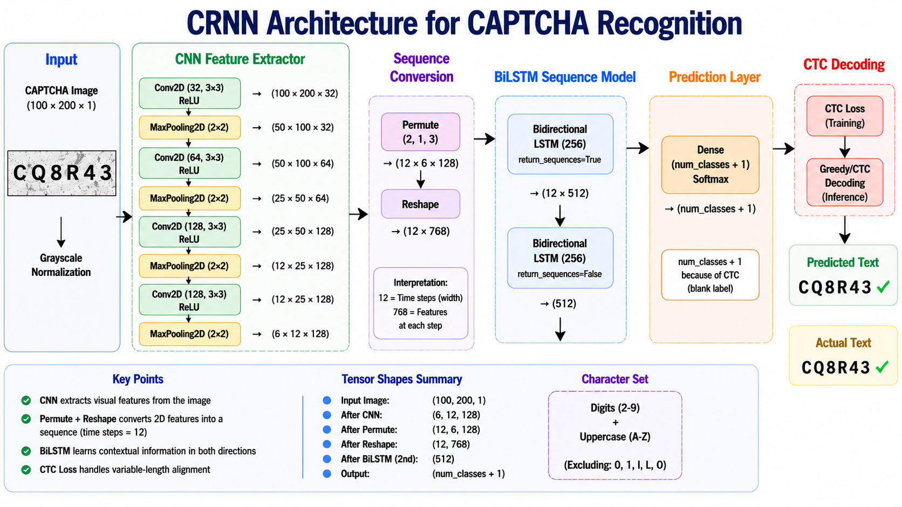

# CRNN CAPTCHA Reader

An end-to-end CAPTCHA recognition system built using Deep Learning. The project uses a CRNN (Convolutional Recurrent Neural Network) architecture combining CNN feature extraction, BiLSTM sequence modeling, and CTC decoding to recognize 6-character CAPTCHA images.

---

## Project Overview

The objective of this project was to build an OCR system capable of reading CAPTCHA images automatically.

### Input

CAPTCHA image containing 6 alphanumeric characters.

### Output

Predicted CAPTCHA text.

### Approach

Image -> CNN Feature Extraction -> BiLSTM Sequence Modeling -> CTC Decoding -> Predicted Text

## Dataset Analysis

The original dataset contained CAPTCHA images and corresponding labels.

### Important Observations

* Characters **0** and **1** do not appear in the dataset.
* Characters **I**, **L**, and **O** do not appear in the dataset.
* Labels corresponding to image IDs **2184** and **6819** were removed during preprocessing due to data issues.

This reduced ambiguity between visually similar characters and simplified the character vocabulary.

---

## Final Results

Evaluation was performed on a held-out validation split (10%).

| Metric | Value |
| :--- | :--- |
| Exact Match Accuracy | 88.25% |
| Character Accuracy | 97.96% |
| Character Error Rate (CER) | 0.0204 |

The model correctly predicts the entire CAPTCHA string in approximately 88% of cases while maintaining a very low character-level error rate.

---

## Sample Prediction

### Example:

Image      → CAPTCHA
Prediction → QVTQ8A
Actual     → QVTQ8A

---

## Network Architecture

### Architecture Summary

* Input Image: 100 × 200 × 1
* CNN Layers for feature extraction
* Max Pooling for dimensionality reduction
* Permute + Reshape to convert image features into a sequence
* Two Bidirectional LSTM layers
* Dense Softmax output layer
* CTC Loss for sequence alignment and training

---

## Notebook Guide

### 01_dataset_exploration.ipynb

Exploratory Data Analysis (EDA) of the dataset.

* Character frequency analysis
* Dataset cleaning
* Identification of missing characters
* Label inspection and visualization

---

### 02_preprocessing.ipynb

Image preprocessing pipeline.

* Loading CAPTCHA images
* Grayscale conversion
* Normalization
* Label encoding

---

### 03_tf_dataset.ipynb

TensorFlow Dataset pipeline creation.

* Train/validation split
* Dataset generation
* Batching and prefetching
* Efficient data loading

---

### 04_CNNdemo.ipynb

Initial CNN experiments.

* Understanding CNN outputs
* Feature extraction tests
* Baseline architecture exploration

---

### 05_CRNN_model.ipynb

Construction of the CRNN architecture.

* CNN feature extractor
* Sequence conversion
* BiLSTM layers
* CTC-compatible output generation

---

### 06_training_model.ipynb

Training setup and experimentation.

* CTC loss implementation
* Optimizer configuration
* Training and validation monitoring
* Fine Tuning

---

### 07_Final_model.ipynb

Final model training and evaluation.

* Architecture refinements
* Model training
* CER calculation
* Accuracy evaluation
* Model saving

---

### 08_submissionEDA.ipynb

Inference on test images and submission generation.

* CAPTCHA prediction
* Result validation
* Submission CSV generation

---

## Repository Structure

CRNN-Captcha-reader/
│
├── 01_dataset_exploration.ipynb
├── 02_preprocessing.ipynb
├── 03_tf_dataset.ipynb
├── 04_CNNdemo.ipynb
├── 05_CRNN_model.ipynb
├── 06_training_model.ipynb
├── 07_Final_model.ipynb
├── 08_submissionEDA.ipynb
│
├── captcha_reader.keras
├── captcha_training.keras
├── char_mapping.pkl
├── history.pkl
│
├── train-labels.csv
├── submission.csv
└── README.md

## Technologies Used

* Python
* TensorFlow / Keras
* OpenCV
* NumPy
* Pandas
* Matplotlib
* Jupyter Notebook

---

## Key Learning Outcomes

* Building a complete OCR pipeline from raw data to inference
* Working with TensorFlow data pipelines
* Understanding CNN and BiLSTM architectures
* Implementing and training models using CTC Loss
* Evaluating OCR systems using Character Error Rate (CER)
* Model deployment and version control using Git and GitHub

---

## Author

**Ronak Das** 
*B.Tech Mechanical Engineering* Indian Institute of Technology Roorkee
